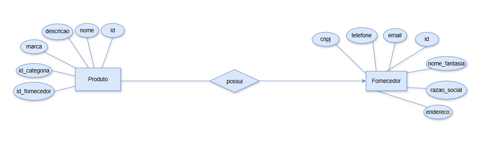
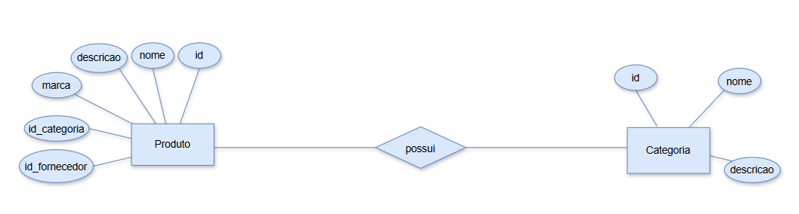
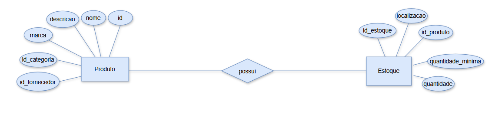
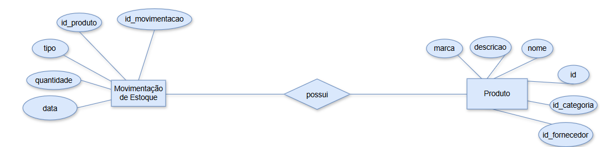
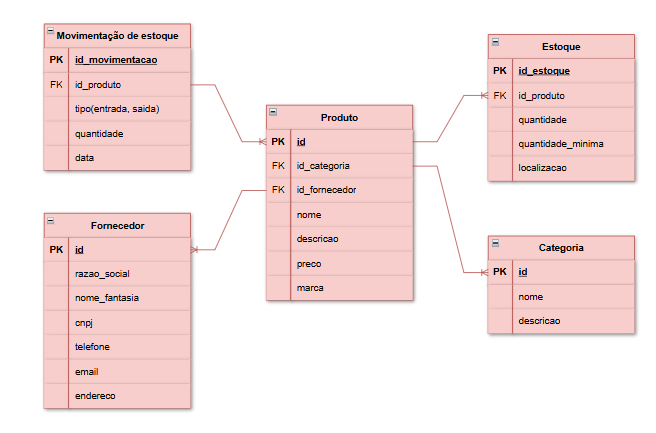

# Projeto: Estoque de uma loja







<br>

## Dicionário de dados
|Entidade|Atributo|Tipo|Tamanho|Descrição|
|-|-|-|-|-|
|Produto|id|int|1|Identificador, PK, auto incrementável|
|Produto|id_categoria|int|1|Identificador, FK|
|Produto|id_fornecedor|int|1|Identificador, FK|
|Produto|nome|varchar|50|Nome do produto|
|Produto|descrição|varchar|200|Descição do produto|
|Produto|preço|decimal|10,2|Preço do produto
|Produto|marca|varchar|30|Marca do produto|
|Categoria|id|int|1|Identificador, PK, auto incrementável|
|Categoria|nome|varchar|50|Nome da categoria|
|Categoria|descrição|varchar|200|Descrição da categoria|
|Fornecedor|id|int|1|Identificador, PK, auto incrementável|
|Fornecedor|razão social|varchar|10|Nome do fornecedor|
|Fornecedor|nome_fantasia|varchar|50|Sigla do nome|
|Fornecedor|cnpj|varchar|15|Cadastro nacional de pessoa jurídica|
|Fornecedor|telefone|varchar|15|Telefone do fornecedor|
|Fornecedor|email|varchar|30|Email do fornecedor|
|Fornecedor|endereço|varchar|50|Endereço do fornecedor|
|Estoque|id_estoque|int|1|Identificador, PK, auto incrementável|
|Estoque|id_produto|int|1|Identificador, FK|
|Estoque|quantidade|int|5|Quantidade a ser comprada|
|Estoque|quantidade mínima|int|1|Quantidade mínima para realizar a compra|
|Estoque|localização|varchar|10|Local do item|
|Movimentação|id_movimentacao|int|1|Identificador, PK, auto incrementável|
|Movimentação|id_produto|int|1|Identificador, FK|
|Movimentação|tipo|enum(entrada, saída)|1|Entrada ou saída do estoque|
|Movimentação|quantidade|int|5|Quantidade enviada/recebida|
|Movimentação|data|date|10|Data da entrada/saída do produto no estoque|

<br>

## Dados de teste em CSV
- [Produto.csv](Produto.csv)
- [Categoria.csv](Categoria.csv)
- [Fornecedor.csv](Fornecedor.csv)
- [Estoque.csv](Estoque.csv)
- [Movimentação.csv](Movimentação.csv)

<br>

## Script SQL DDL (Desenvolvimento: Criação do Banco de dados)
```SQL
drop database if exists gestao_pedido;
create database gestao_pedido;
use gestao_pedidos;
create table produto(
    id int not null primary key auto_increment,
    id_categoria int not null required,
    id_fornecedor int not null required,
    nome varchar (50) not null required,
    descricao varchar (200) not null required,
    preco int (5) not null required,
    marca varchar (30) not null required
);
create table categoria(
    id int not null primary key auto_increment,
    nome varchar (50) not null required,
    descricao varchar (200) not null required
);
create table fornecedor(
    id int not null primary key auto_increment,
    razao_social varchar (10) not null required,
    nome_fantasia varchar (50) not null required,
    cnpj varchar (15) not null required,
    telefone varchar (15) not null required,
    email varchar (30) not null required,
    endereco varchar (50) not null required
);
create table estoque(
    id_estoque int not null primary key auto_increment,
    id_produto int not null required,
    quantidade int (5) not null required,
    quantidade_minima int (1) not null required,
    localizacao varchar (10) not null required
);
create table movimentacao(
    id_movimentacao int not null primary key auto_increment,
    id_produto int not null required,
    tipo enum(entrada, saida) not null required,
    quantidade int (5) not null required,
    data varchar (10) not null required
);

alter table produto add constraint fk_produto foreign key (id) references movimentacao(id_produto);
alter table fornecedor add constraint fk_fornecedor foreign key (id) references produto(id_fornecedor);
alter table estoque add constraint fk_estoque foreign key (id) references produto(id);
alter table categoria add constraint fk_categoria foreign key (id_categoria) references produto(id_categoria);

describe produto;
describe categoria;
describe fornecedor;
describe estoque;
describe movimentacao;
show tables;
```

<br>

## Script SQL DML (Manipulação: População com dados de teste)
```SQL

```
